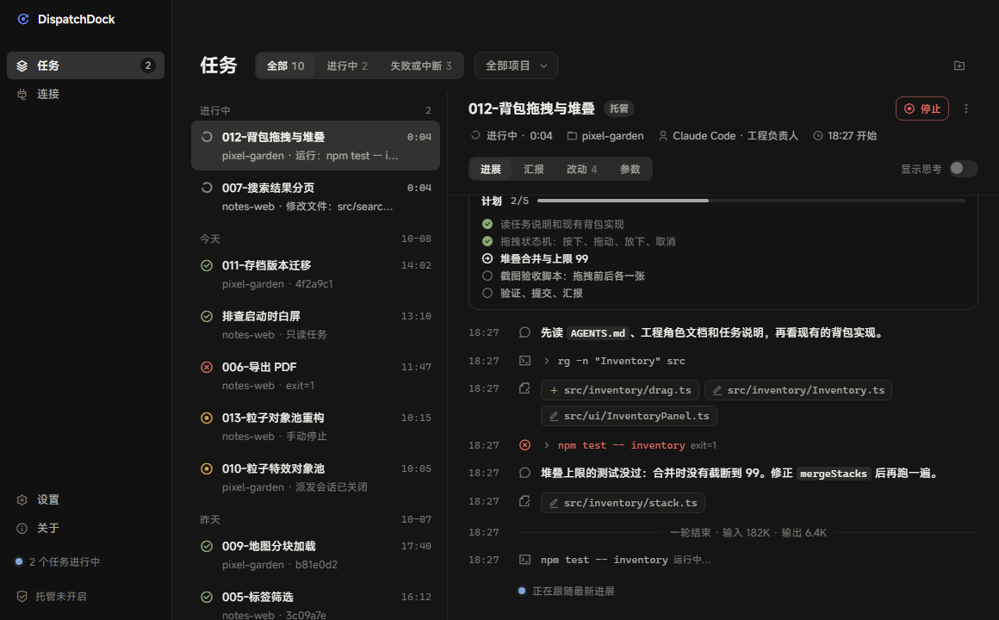
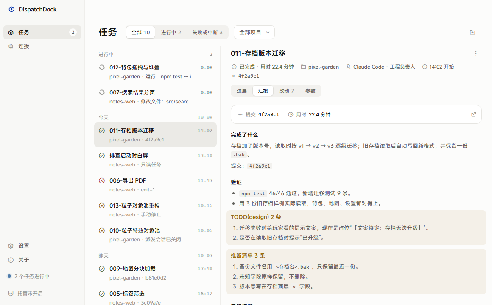
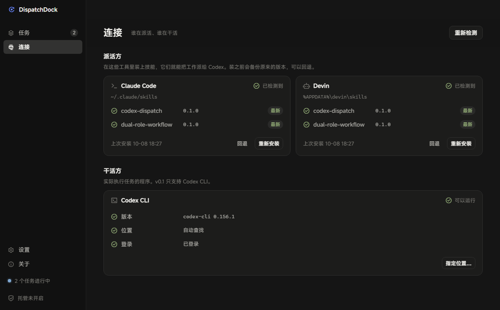
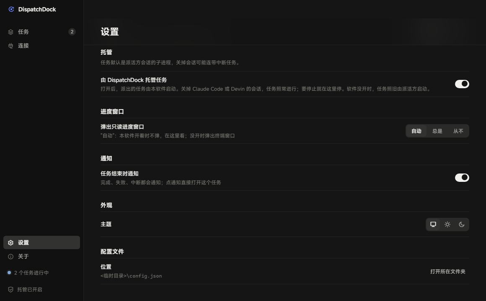

<p align="center"></p>

<h1 align="center">DispatchDock</h1>

<p align="center">Let one agent dispatch work to another, and watch, stop and review it in one place.</p>

<p align="center"><a href="README.md">中文</a> · English</p>

<p align="center">▶ <a href="https://www.bilibili.com/video/BV1kBHX6CE3d">2.5-minute intro video (Bilibili, in Chinese)</a></p>



> The app's interface is in Chinese for now. The skills are written in Chinese too; the agents that read them work fine in any language.

## What it is

You talk things through with a model in Claude Code and make the decisions. Execution work that can be clearly specified gets dispatched to Codex CLI to run in the background. DispatchDock covers both sides of that:

- **Dispatching**: two skills you install into the dispatching agent. They teach it how to hand off work, follow progress, read the report and review the result.
- **Watching**: a desktop app that shows every dispatched task in one window: live progress, the report, which files changed. You can stop any task.

The two parts work independently. With only the skills installed, progress shows up in a read-only terminal window.

v0.1 supports:

| | |
|---|---|
| Dispatchers | Claude Code (including the Code tab in Claude Desktop), Devin |
| Workers | Codex CLI |
| OS | Windows 10 / 11 |

## The two skills

- **`codex-dispatch`**: hands a piece of work (a spec file or a plain task description) to Codex, runs it in the background, follows progress, reads the report and reviews the result. It assigns no role by itself.
- **`dual-role-workflow`**: a way of splitting the work. The model you are talking to acts as the *design lead*: direction, taste, decisions and review. Codex acts as the *engineering lead*: everything that can be clearly specified and objectively verified. The point is to spend the expensive tokens on judgment and hand the volume to Codex.

## The app

| | |
|---|---|
|  |  |

- **Tasks**: running tasks stay on top with their latest step and elapsed time. The detail view shows the plan, a progress timeline (expand any command to see its output), the report, changed files and dispatch parameters. You get a system notification when a task ends.
- **Connections**: detects which dispatchers are installed, and installs or updates the skills in one click. It backs up first and can roll back. Skills you have modified yourself are never replaced unless you say so.
- **Settings**: default model, reasoning effort, service tier and sandbox for dispatched work. Leave them unset to follow Codex's own config.
- **Managed mode**: when on, DispatchDock starts the dispatched tasks itself. Closing the Claude Code or Devin session, or even closing DispatchDock, does not stop them.



## Install

You need:

- [Codex CLI](https://github.com/openai/codex), signed in. `codex --version` should print a version.
- [Node.js](https://nodejs.org/) 24 or later. The dispatch script runs on Node with zero dependencies; no `npm install` needed.

### Option 1: the app (recommended)

1. Download the installer (`.exe`) from [Releases](https://github.com/LBEILC/DispatchDock/releases) and run it.
2. The installer is not code-signed. Windows may show "Windows protected your PC": click "More info", then "Run anyway".
3. On first launch a short setup detects your dispatchers and Codex, installs the skills and sets defaults. Every step can be skipped and changed later on the Connections and Settings pages.

### Option 2: skills only

1. Download `dispatchdock-skills-<version>.zip` from Releases and unzip it.
2. In the unzipped folder run:
   ```bash
   node installer/install.mjs
   ```
   It detects Claude Code and Devin, installs the skills into their skill folders and offers to set defaults. Existing skills are backed up first.
3. To undo the last install or update:
   ```bash
   node installer/install.mjs --rollback
   ```

## Usage

Just ask in Claude Code, for example:

- "Hand `docs/specs/012-inventory-drag.md` to Codex"
- "Have codex add a remember-me option to the login page"

The model dispatches it in the background with `codex-dispatch` and tells you the record name and where to watch progress. When Codex is done, the model reads the report, checks the commit, runs the checks and tells you the result in plain words.

For an ongoing "design lead + Codex executes" collaboration, ask it to set up `dual-role-workflow` in your project. It creates `AGENTS.md`, role documents and a spec folder.

### Defaults

Dispatch defaults live in `config.json`: `%APPDATA%\codex-dispatch\` on Windows, `~/.config/codex-dispatch/` elsewhere. Change them on the Settings page, or from the command line:

```bash
node <codex-dispatch skill folder>/codex-task.mjs --config
```

With no arguments it shows the current values. Pass `model=<name>`, `effort=high` and so on to change them; use `-` as the value to go back to following Codex.

## How it works

The skills and the app never talk over the network. They share a few local files:

- Each task's records live in the repo's `.codex-runs/`: the report, a short progress log, structured events, and raw output.
- The list of all tasks is in `%APPDATA%\codex-dispatch\runs.jsonl`.

The format is specified in [`docs/protocol.md`](docs/protocol.md) (Chinese). Other tools can read the same files, and new workers can be added through an adapter; see [`skills/codex-dispatch/adapters/README.md`](skills/codex-dispatch/adapters/README.md).

## Privacy

Everything stays on your machine. DispatchDock itself makes no network requests and collects no data; only Codex goes online.

## Development

```bash
npm install
npm run fonts      # fetch the MiSans font from its official page (not checked in)
npm run demo       # start with demo data, never touches your real tasks
npm run verify     # tests and type checks
npm run dist       # build the installer
```

This project was itself built with `dual-role-workflow`. The split is described in [`AGENTS.md`](AGENTS.md) and [`docs/roles/`](docs/roles/), the UI rules in [`docs/design.md`](docs/design.md), and the mockups live in [`app/design/`](app/design/).

## License

[MIT](LICENSE). Notices for the MiSans font and the Remix Icon set are in [`THIRD_PARTY_NOTICES.md`](THIRD_PARTY_NOTICES.md).
